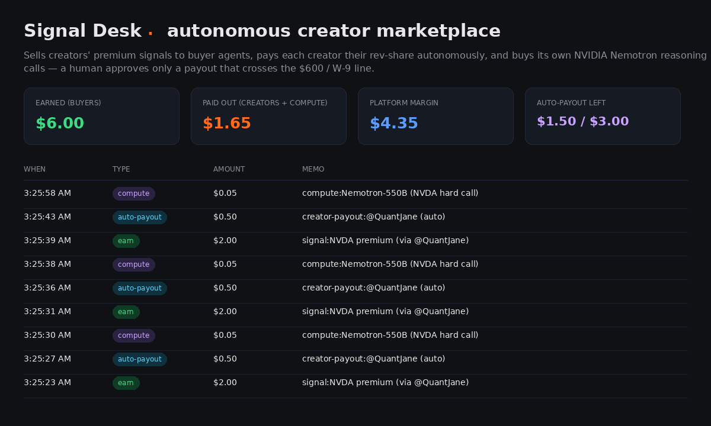

# The Signal Desk — an autonomous creator marketplace

> Built for the **Hermes Agent Accelerated Business Hackathon** (NVIDIA × Stripe × Nous Research).
> An AI agent that **earns, pays its creators, pays for its own intelligence, and runs its own P&L**
> — autonomously — with a human authorizing only the one thing that legally requires it.



A marketplace for trading signals. Buyer agents pay per call (earn). Each premium signal is a
*creator's* strategy, so the desk **pays that creator their rev-share** — and it does that
**autonomously, within an allowance a human authorized once**. On a *hard* call it also **buys its
own NVIDIA Nemotron 550B reasoning** (easy calls use the free local read). The only thing it
escalates to a human is a payout that would cross the **IRS $600 / W-9** reporting line. Autonomy by
default; a human exactly at the legal boundary. It's the *fundable* version of an agent business —
the same `propose → approve → execute` pattern that runs in production at
[Clock Out Capital](https://clockoutcapital.com).

---

## How the money flows

```
  Buyer agent ──GET /signal/NVDA?premium──▶  Signal Desk (FastAPI, HTTP-402 seller)
       │                                        │
       │  402 + Stripe payment challenge         │   EARN: charge the buyer's Shared
       │◀────────────────────────────────────────│         Payment Token (PaymentIntent)
       │  retry with SPT ────────────────────────▶│         ── ledger +$2.00
       │                                        │
       │           premium = a creator's        ▼
       │           strategy                ┌─ pay creator rev-share ──▶ within allowance? pay AUTONOMOUSLY
       │                                   │                             ── allowance −$0.50 (no human)
       │                                   │                          over $600/W-9? ─▶ human approves in Link
       │                                   │                             ── ledger "W-9 approved" (the exception)
       │                                   └─ hard call? ─▶ pay for NVIDIA Nemotron 550B reasoning
       ▼                                                     ── ledger "compute"; easy calls = free local read
   signal + rationale               Live ledger: earn − payouts − compute = platform margin
```

## Sponsor tech
- **Hermes (Nous Research)** — a Hermes agent is the **buyer**. In oneshot mode (`hermes -z`) with an
  isolated `HERMES_HOME` and a custom `signal-desk-buyer` skill, it reasons on Nemotron, discovers the
  skill, and pays the desk's HTTP-402 — genuine agent-to-agent commerce, no human in the loop.
- **Stripe Skills for Hermes / Shared Payment Tokens** — the buyer pays the 402 with an SPT (earn); the
  desk autonomously mints + charges SPTs to pay creators (spend); `@stripe/link-cli --test` drives the
  human approval for the over-threshold W-9 payout. All **test mode** — no real money moves.
- **NVIDIA Nemotron 3 Ultra** — the desk *pays for* 550B reasoning on hard calls (a real, metered cost
  on its P&L). Easy calls use the free local read — the agent manages its own compute budget.
- **NVIDIA NemoClaw / OpenShell** — the productized form of this exact `propose → approve → execute`
  gate; cited as the deployment target for the safety layer.

## The autonomy model (why a human is *not* in every loop)
A human authorizes an **auto-payout allowance** (`PAYOUT_BUDGET_CENTS`). The agent then runs the
marketplace on its own — collecting revenue, paying creators, buying reasoning, managing margin — with
no per-transaction approval. The gate fires **only** when a creator payout would cross the IRS $600 /
W-9 reporting line: the one case a human legally must handle. That's autonomy that's safe to fund: no
runaway payouts, no prompt-injection blank check, and it respects real tax compliance — but no babysitter.

## Quickstart (test mode)

```bash
# 1. deps (Python only — the earn/spend core needs no npm)
python3 -m venv .venv && .venv/bin/pip install -r seller/requirements.txt

# 2. configure — copy and fill with TEST keys (sk_test_…, nvapi-…)
cp seller/.env.example seller/.env     # then edit

# 3. prove the Stripe + Nemotron lanes work
.venv/bin/python verify_stripe.py      # mints + charges a test SPT  → "EARN LOOP PROVEN"
.venv/bin/python verify_nemotron.py    # one Nemotron 3 Ultra call

# 4. run the desk (loopback) with a small allowance for a clean demo
PAYOUT_BUDGET_CENTS=150 .venv/bin/python run_seller.py    # http://127.0.0.1:8800/

# 5. in another terminal, be the buyer
.venv/bin/python buyer_http.py NVDA              # earn only
.venv/bin/python buyer_http.py NVDA --premium    # earn + autonomous creator payout + Nemotron (×3)
.venv/bin/python buyer_http.py NVDA --premium    # 4th → payout crosses $600/W-9 → human approves in Link
```

Open **http://127.0.0.1:8800/** for the live ledger (earn / paid-out / platform margin / auto-payout left).

## Repo layout
```
seller/
  app.py          FastAPI HTTP-402 seller + creator payouts + hard-call Nemotron + live ledger
  payments.py     Stripe SPT earn-charge + autonomous creator payout + W-9 link-cli escalation
  stripe_http.py  tiny stdlib Stripe client (no SDK dependency)
  reason.py       Nemotron 3 Ultra rationale (the paid "think harder" lane)
  signals.py      signal source (Clock Out Capital screener + offline fallback)
  ledger.py       sqlite earn/spend ledger
run_seller.py     launch the desk (loopback)
buyer_http.py     a buyer agent that pays the 402
agent_buy.py      one-line buyer the Hermes skill invokes (pure stdlib)
hermes/           Hermes agent buyer — config + signal-desk-buyer skill (see hermes/README.md)
verify_stripe.py  / verify_nemotron.py / verify_budget.py   — lane probes
DEMO.md / RECORD.md   video script + recording runbook
```

## Safety & scope
Everything is **test mode**: `sk_test_` keys, Stripe test card `4242…`, `--test` payout credentials. No
real funds move. In production, creator payouts are Stripe Connect transfers; here the money movement is
modeled with test credentials. Money-touching actions are gated by the allowance and, at the boundary, a
human approval the agent cannot self-grant. Creators shown in the demo are fictional; surfacing is
algorithmic and labeled, and signal language is educational only.

---

*Built on Clock Out Capital's real signal engine, creator program, and its production
`propose → approve → execute` governance.*
